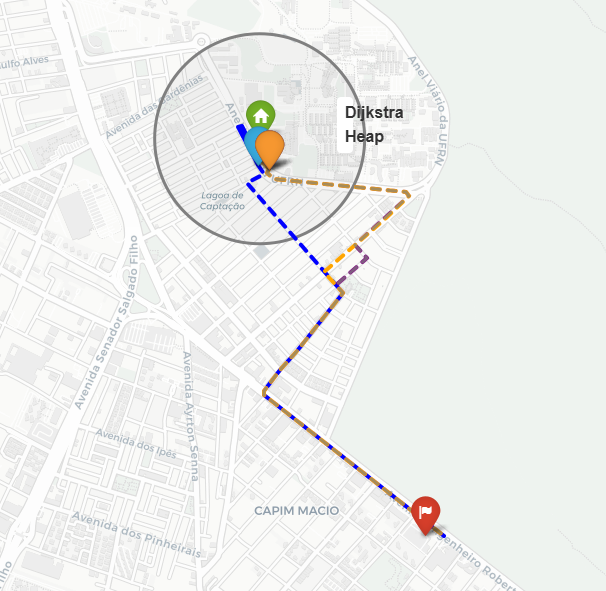
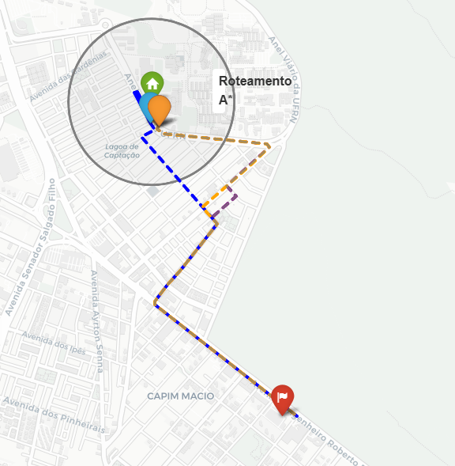
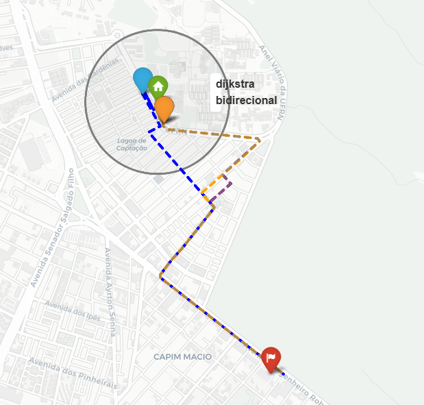

# Modelagem e Análise de Rotas Urbanas com Grafos

Ferramenta para análise de rotas urbanas multimodais (caminhada + carro) a partir de dados reais do OpenStreetMap. Dado um ponto de origem **A**, um destino **B** e uma distância máxima de caminhada **X**, o sistema encontra o ponto de embarque **P** que minimiza o custo total da rota **A → P** (a pé) + **P → B** (carro).

O cenário estudado tem como origem (A) o **Museu de Morfologia da UFRN** e como destino (B) o **Assaí Atacadista**, ambos em Natal/RN, com distância máxima de caminhada X = 500 m.

---

### Alunos
- Alan César Rebouças de Araújo Carvalho
- Erick Henrique da Silva Paz
- Matheus Silva Mendes

**Disciplina:** Algoritmos e Estruturas de Dados II — UFRN

---

## 🚀 Instalação

### 📦 Dependências

| Biblioteca | Uso |
|---|---|
| `osmnx` | Download e modelagem da rede viária via OpenStreetMap |
| `networkx` | Construção, análise e algoritmos de caminho mínimo nos grafos |
| `matplotlib` | Visualização dos grafos e resultados |
| `numpy` | Cálculo de estatísticas e métricas |
| `folium` | Geração de mapas interativos |

### 1. Clone o repositório

```bash
git clone https://github.com/kire-h/Trabalho3_ED2
cd Trabalho3_ED2
```

### 2. Instale as dependências

```bash
pip install osmnx networkx matplotlib numpy folium
```

> ⚠️ Os notebooks foram desenvolvidos no **Google Colab**. Para rodar localmente, certifique-se de que as dependências acima estão instaladas no seu ambiente.

---

## ▶️ Como usar

### Google Colab (recomendado)

1. Faça upload do notebook desejado (`A_Star_Final.ipynb`, `Dijkstra_final.ipynb` ou `Dijkstra_Bidirecional.ipynb`) no Google Colab
2. Execute as células em ordem
3. Os grafos e resultados serão gerados automaticamente

### Localmente

```bash
jupyter notebook A_Star_Final.ipynb
```

> ⚠️ A célula de instalação (`!pip install osmnx ...`) pode ser ignorada se as dependências já estiverem instaladas.

---

## 🖥️ Estrutura do Repositório

```text
├── A_Star_Final.ipynb             # Implementação do algoritmo A* com heurística geográfica
├── images                         # Pasta com as imagens para o repositório
├── Dijkstra_final.ipynb           # Dijkstra Simples e Dijkstra com Heap (benchmark)
├── Dijkstra_Bidirecional.ipynb    # Dijkstra Bidirecional via NetworkX
└── README.md                      # Documentação principal
```

---

## 🗺️ Modelagem do Problema

### Representação como grafo

A rede viária foi obtida via OSMnx com dados do OpenStreetMap. Foram utilizados **dois grafos distintos**, ambos do tipo multigrafo direcionado (MultiDiGraph):

- **Grafo drive** (raio 4 km): usado no trecho **P → B** de carro. Contém 4.963 nós e 12.356 arestas.
- **Grafo walk** (raio 700 m ao redor de A): usado para encontrar os candidatos **P** e calcular a caminhada **A → P**. Contém 925 nós e 2.584 arestas.

### Nós e Arestas

- **Nós** representam interseções viárias (cruzamentos ou pontos de rua).
- **Arestas** representam segmentos de rua com atributos de comprimento, velocidade máxima permitida e tempo estimado de viagem.

### Pesos utilizados

Três funções de custo foram modeladas:

| Peso | Descrição |
|---|---|
| `length` (m) | Distância física da aresta |
| `travel_time` (s) | Tempo estimado pelo OSMnx sem trânsito |
| `travel_time_transito` (s) | Tempo com fator de congestionamento sintético (fator aleatório U[1,0; 3,5] por aresta, seed=42) |

A velocidade de caminhada foi fixada em **v_walk = 1,4 m/s**.

---

## 🔬 Algoritmos Implementados

### Dijkstra Simples

Implementado manualmente sem estruturas auxiliares. A cada iteração, percorre **linearmente** todos os nós ainda não visitados para encontrar o de menor custo acumulado — operação O(V) repetida V vezes, resultando em O(V²) no total. Funciona corretamente, mas se torna proibitivamente lento em grafos grandes. Neste projeto serve como **referência didática** para demonstrar, por contraste, o ganho real do Dijkstra com Heap.

### Dijkstra com Heap

Também implementado manualmente, mas usando `heapq` (fila de prioridade por min-heap). Em vez de varrer todos os nós a cada iteração, extrai o de menor custo em **O(log V)** — tornando o algoritmo drasticamente mais eficiente em grafos esparsos como redes viárias. Foi o algoritmo principal do projeto: avaliou todos os 82 candidatos P em 2,62 s, contra 135,67 s do Dijkstra Simples para o mesmo conjunto (51,7× mais rápido), com resultados idênticos.

### A\* com Heurística Geográfica

Extensão inteligente do Dijkstra: além do custo acumulado do caminho percorrido, o A\* usa uma **função heurística `h(u)`** que estima o custo restante até o destino B. Isso guia a busca na direção certa, evitando explorar nós que estão "indo para o lado errado".

A heurística usada é a **distância em linha reta** (great circle / Haversine) entre o nó atual e B, calculada a partir das coordenadas geográficas reais (latitude e longitude):

```python
dist_metros = ox.distance.great_circle(
    G.nodes[u]['y'], G.nodes[u]['x'],  # nó atual
    G.nodes[v]['y'], G.nodes[v]['x']   # destino B
)
```

Essa escolha é **admissível** — nunca superestima o custo real, pois nenhuma rua pode ser mais curta do que a linha reta entre dois pontos. Para o peso `travel_time`, a distância é convertida pela velocidade máxima do grafo (120 km/h ≈ 33,3 m/s), mantendo a admissibilidade para tempo.

### Dijkstra Bidirecional

Em vez de partir apenas de A e expandir até alcançar B, o Dijkstra Bidirecional executa **duas buscas simultâneas**: uma da origem A para frente, e outra do destino B para trás (no grafo reverso). As duas frentes avançam em paralelo e se encontram no meio do caminho, reduzindo o espaço total de nós expandidos — especialmente vantajoso quando A e B estão distantes entre si, como no cenário deste projeto. Implementado via `nx.bidirectional_dijkstra` do NetworkX, produziu resultados idênticos aos demais algoritmos em todos os cenários.

---

## 📈 Resultados

### Comparação dos 5 cenários por algoritmo

Todos os algoritmos produziram distâncias e tempos equivalentes nos cenários 2, 3, 4 e 5. No cenário 1 (menor distância), o Bidirecional escolheu um P diferente (walk 250 m, nó `501033902`) do Heap e do A* (walk 458 m, nó `501834700`), embora a distância total tenha ficado igual (2.990,1 m) — evidência de que existem múltiplos pontos P com a mesma distância total ótima, e cada algoritmo desempatou de forma diferente internamente.

**Dijkstra Simples**


| Cenário | Distância (m) | Tempo (s) |
|---|:---:|:---:|
| 1 – Menor distância (P, walk 458 m) | 2.990,1 | 533,8 |
| 2 – Mais rápido s/ trânsito (P, walk 144 m) | 3.238,5 | 320,9 |
| 3 – Mais rápido c/ trânsito (P, walk 144 m) | 3.238,5 | 630,9 |
| 4 – Sem caminhada (A∉drive, walk 144 m) | 3.238,5 | 320,9 |
| 5 – Ganho ao caminhar (vs. C4) | +248,3 m | 0,0 s |

**Dijkstra Heap**



| Cenário | Distância (m) | Tempo (s) |
|---|:---:|:---:|
| 1 – Menor distância (P, walk 458 m) | 2.990,1 | 533,8 |
| 2 – Mais rápido s/ trânsito (P, walk 144 m) | 3.238,5 | 320,9 |
| 3 – Mais rápido c/ trânsito (P, walk 144 m) | 3.238,5 | 630,9 |
| 4 – Sem caminhada (A∉drive, walk 144 m) | 3.238,5 | 320,9 |
| 5 – Ganho ao caminhar (vs. C4) | +248,3 m | 0,0 s |

**A\* com Heurística Geográfica**



| Cenário | Distância (m) | Tempo (s) |
|---|:---:|:---:|
| 1 – Menor distância (P, walk 458 m) | 2.990,1 | 533.8 |
| 2 – Mais rápido s/ trânsito (P, walk 144 m) | 3.238,5 | 320,0 |
| 3 – Mais rápido c/ trânsito (P, walk 144 m) | 3.238,5 | 629,1 |
| 4 – Sem caminhada (A∉drive, walk 144 m) | 3.238,5 | 320,0 |
| 5 – Ganho ao caminhar (vs. C4) | +248,3 m | 0,0 s |

**Dijkstra Bidirecional**



| Cenário | Distância (m) | Tempo (s) |
|---|:---:|:---:|
| 1 – Menor distância (P, walk 250 m) | 2.990,1 | 412,3 |
| 2 – Mais rápido s/ trânsito (P, walk 144 m) | 3.238,4 | 320,9 |
| 3 – Mais rápido c/ trânsito (P, walk 144 m) | 3.238,4 | 626,2 |
| 4 – Sem caminhada (A∉drive, walk 144 m) | 3.238,4 | 320,9 |
| 5 – Ganho ao caminhar (vs. C4) | +248,2 m | 0,0 s |

### Benchmark: Dijkstra Simples vs. Heap

| Peso | Simples (s) | Heap (s) | Speedup |
|---|:---:|:---:|:---:|
| Distância | 0,6875 | 0,0105 | 65× |
| Tempo | 1,0088 | 0,0176 | 57× |

#### Ao avaliar todos os 82 candidatos P, o Heap concluiu em **2,62 s** contra **135,67 s** do Simples (51,7× mais rápido), com resultados idênticos em todos os cenários.
---

##  Perguntas e Respostas

### 1. Como o problema foi modelado como grafo?

A rede viária real de Natal/RN foi extraída do OpenStreetMap via OSMnx e convertida em dois grafos dirigidos: um para tráfego de carro (raio de 4 km, para o trecho P→B) e outro para pedestres (raio de 700 m ao redor de A, para o trecho A→P). O problema é tratado como caminho mínimo multimodal: dado um conjunto de candidatos P dentro da distância máxima de caminhada X = 500 m, busca-se o P que minimiza o custo total (caminhada + carro).

### 2. O que representam os nós e as arestas?

Cada **nó** representa uma interseção viária — um cruzamento ou ponto de encontro de ruas. Cada **aresta** representa um segmento de rua entre duas interseções, carregando atributos como comprimento em metros, velocidade máxima permitida e tempo estimado de percurso.

### 3. Quais pesos foram usados?

Três pesos foram modelados: `length` (distância física em metros), `travel_time` (tempo estimado sem trânsito, calculado pelo OSMnx com base na velocidade da via) e `travel_time_transito` (tempo com fator de congestionamento sintético, multiplicando `travel_time` por um fator aleatório entre 1,0 e 3,5 por aresta, com seed fixo para reprodutibilidade).

### 4. Como o trânsito sintético alterou as rotas?

O trânsito sintético não alterou a escolha do ponto P ótimo — o mesmo P do cenário sem trânsito foi selecionado no cenário com trânsito. Porém, o custo estimado sofreu impacto significativo: o tempo subiu de 320,9 s para 630,9 s (+96,6%), reflexo do fator médio de congestionamento de 2,25× aplicado por aresta. Isso demonstra que, embora o trânsito sintético não mude a topologia do melhor caminho neste experimento, ele afeta substancialmente a estimativa de custo ao usuário.

### 5. Caminhar alguns metros melhorou a solução?

Em termos de distância, sim: o cenário de menor distância (cenário 1, caminhada de 458 m) economizou 248 m no total em relação ao cenário sem caminhada. Em termos de tempo, não houve ganho — todos os cenários com caminhada foram iguais ou mais lentos que o cenário de referência (sem caminhada intencional), pois a velocidade a pé (1,4 m/s) é muito menor que a de carro. Vale notar que mesmo o cenário "sem caminhada" exigiu 144 m a pé, pois o ponto A não possuía nó correspondente no grafo de carro.

### 6. Em quais casos caminhar atrapalhou?

Caminhar prejudicou explicitamente no **cenário 1** (menor distância): o P escolhido exigiu 458 m a pé por ruas mais lentas de carro, tornando a rota 66% mais lenta que o cenário de referência (533,8 s vs. 320,9 s). Caminhar mais reduziu a distância, mas piorou consideravelmente o tempo total. Isso ocorre porque o P de menor distância se encontrava sobre a própria rota direta A→B, fazendo com que a caminhada apenas substituísse um trecho inicial de carro por deslocamento a pé.

### 7. A menor distância foi também a rota mais rápida?

Não. O cenário de menor distância (C1, 2.990,1 m) levou 533,8 s, enquanto o cenário mais rápido (C2/C4, 3.238,5 m) levou apenas 320,9 s. A rota mais curta em metros não corresponde à mais rápida em tempo porque envolve mais caminhada (baixa velocidade) e trechos de carro menos eficientes. O trade-off entre distância e tempo é um resultado central do trabalho.

### 8. O A* expandiu menos nós que o Dijkstra?
Sim, e os dados do experimento comprovam. O A* expandiu apenas 228 nós contra 753 do Dijkstra Heap — uma redução de 69,7%. A heurística geográfica (distância Haversine até B) guia a busca na direção do destino, evitando expandir regiões do grafo que claramente não fazem parte do caminho ótimo. Apesar disso, o ganho em nós não se traduziu diretamente em ganho de tempo de execução neste experimento, pois o overhead do cálculo da heurística por nó parcialmente compensou a economia. Os resultados produzidos foram idênticos aos do Dijkstra.

### 9. O Dijkstra com Heap foi mais eficiente que o Dijkstra Simples?

Sim, de forma expressiva. O Dijkstra com Heap foi **57 a 65 vezes mais rápido** em uma única execução A→B. Na avaliação completa dos 82 candidatos P, o Heap concluiu em 2,62 s enquanto o Simples levou 135,67 s (51,7× mais lento). Ambos produziram resultados matematicamente idênticos em todos os cenários, confirmando que a diferença é puramente de eficiência computacional.

### 10. O algoritmo da literatura (Dijkstra Bidirecional) trouxe algum ganho?

O Dijkstra Bidirecional trouxe ganho qualitativo em relação ao Dijkstra convencional: ao executar duas buscas simultâneas (de A e de B no grafo reverso), reduz o espaço de busca expandindo nós apenas até o ponto de convergência no meio do caminho, em vez de explorar todo o grafo a partir de uma única origem. Esse benefício é especialmente pronunciado para pares A–B distantes, como no cenário estudado. Os resultados foram idênticos aos demais algoritmos em todos os cenários, validando sua corretude.

### 11. Quais limitações existem na modelagem proposta?

As principais limitações identificadas são:

- O trânsito sintético é aleatório e uniforme por aresta, sem considerar horário do dia, dia da semana ou tipo de via (arterial vs. local).
- A velocidade de caminhada é constante para todos os trechos, ignorando relevo, semáforos, travessias e qualidade das calçadas.
- O critério de menor distância pode selecionar um P sobre a própria rota direta, sem benefício real de tempo — o que é uma limitação do critério, não do algoritmo.
- A heurística do A\* pode ser prejudicial em grafos densos quando seu custo de cálculo supera o ganho em nós não expandidos.
- Nós do grafo walk podem não existir no grafo drive, exigindo filtro de compatibilidade e podendo forçar caminhada mesmo no cenário "sem caminhada".
- O ponto de origem A não possuía nó correspondente no grafo de carro, o que aproximou indevidamente os cenários 2 e 4 e dificultou a comparação direta entre caminhar e não caminhar.

### 12. Como o modelo poderia ser aproximado de um aplicativo real de mobilidade?

Para aproximar o modelo de um sistema real, seria necessário:

- Substituir o trânsito sintético por dados históricos ou em tempo real (ex: APIs de tráfego como Google Maps ou HERE).
- Modelar o **tempo de espera pelo veículo** em cada candidato P, que varia com a oferta de motoristas na região — uma variável central em aplicativos como Uber e 99.
- Combinar múltiplos critérios simultaneamente: tempo, distância e custo monetário da corrida.
- Personalizar a velocidade de caminhada por perfil de usuário (idade, mobilidade reduzida, clima).
- Garantir que origem e destino estejam sempre mapeados sobre a rede viária de carro, evitando a ambiguidade do cenário 4.
- Incorporar restrições de mão única, rotatórias e vias com acesso restrito com maior fidelidade ao comportamento real de roteamento.

---

## 📚 Referências

- [OSMnx — Boeing, 2017](https://github.com/gboeing/osmnx)
- [NetworkX Documentation](https://networkx.org/)
- [OpenStreetMap](https://www.openstreetmap.org/)
- Cormen, T. H. et al. *Introduction to Algorithms*, 3rd ed. MIT Press, 2009.
